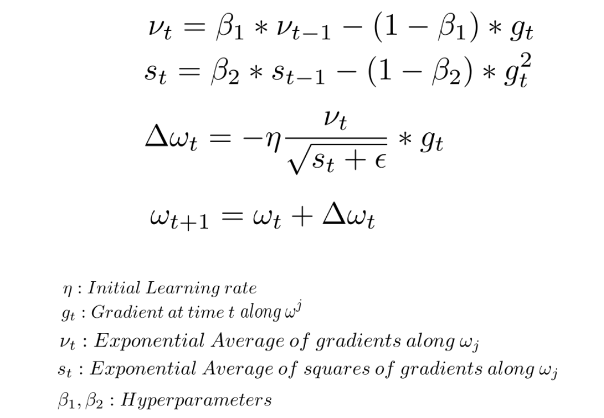
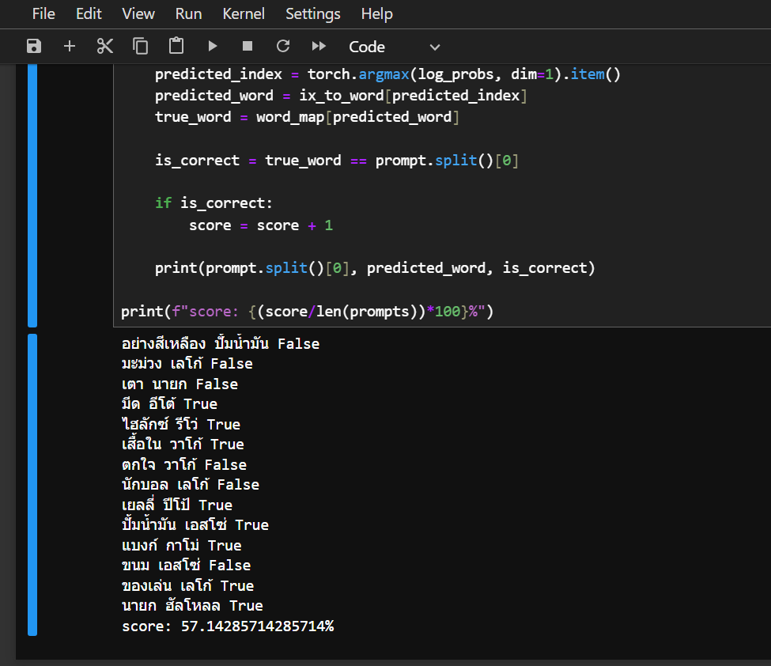

# Word2Vec Boba

This is to POC in topic of **"Word2Vec"** using N-Gram.

## Word Vector Size:

Word Vector Size: (29, 10)

## Test Sentence:

อย่างสีเหลือง เยลโล่ 
มะม่วง แมงโก้ 
เตา อั้งโล่ 
มีด อีโต้ 
ไฮลักซ์ รีโว่ 
เสื้อใน วาโก้ 
ตกใจ โอ้โห้ 
นักบอล โรนัลโด้ 
เยลลี่ ปีโป้ 
ปั้มน้ำมัน เอสโซ่ 
แบงก์ กาโม่ 
ขนม ยูโร่ 
ของเล่น เลโก้ 
นายก ฮัลโหลล 

## Layers:

Linear(word_to_vec_size, 128, bias=True) 
ReLu 
Linear(128, 128, bias=True) 
ReLu 
Linear(128, word_to_vec_size, bias=True) 

## Optimizer:
Adam

## Accuracy:

Score: 57.14%

